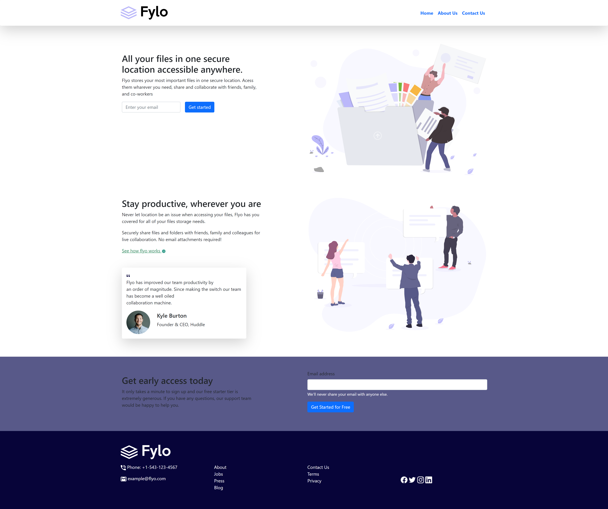

# flyo-landing

## Welcome! 👋

Thanks for checking out this challenge out.

**To do this challenge, you need a basic understanding of HTML and CSS.**

## The challenge

Your challenge is to build out this feature section and get it looking as close to the design as possible.

You can use any tools you like to help you complete the challenge. So if you've got something you'd like to practice, feel free to give it a go.

Your users should:

- View the optimal layout for the site depending on their device's screen size

## Where to find everything

Your task is to build out the project to the designs inside the `/design` folder. You will find both a mobile and a desktop version of the design. 

The designs are in JPG static format. Using JPGs will mean that you'll need to use your best judgment for styles such as `font-size`, `padding` and `margin`. 

You will find all the required assets in the `/images` folder. The assets are already optimized.

There is also a `style-guide.md` file containing the information you'll need, such as color palette and fonts.

## Building your project

Feel free to use any workflow that you feel comfortable with. 

## Deploying your project

There are many ways to host your project for free. Hosts include:

- [GitHub Pages](https://pages.github.com/)
- [Vercel](https://vercel.com/)
- [Netlify](https://www.netlify.com/)

## built-with

Built with HTML, CSS media queries, and bootstrap.

## Got feedback for me?

Email me at [Godstime Nwabue](nwabuegodstime@gmail.com)

## Project live
[Frontend Mentor | flyo-landing | Revamped](https://godstimenwabue.github.io/flyo-landing/)

## Connect with me

[Godstime Nwabue](https://www.linkedin.com/in/godstime-nwabue-08481b128/)

**Have fun building!** 🚀